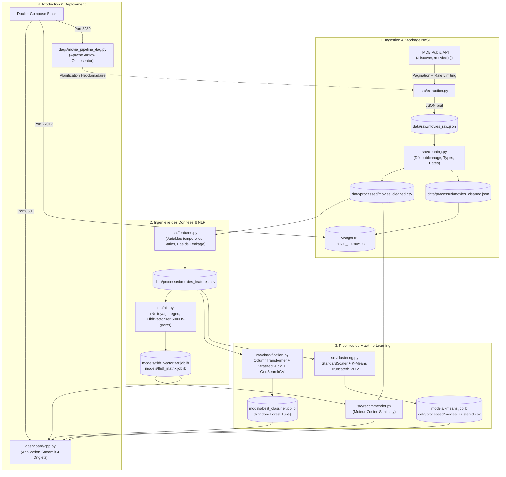
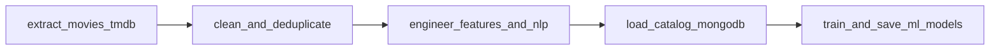

# 🎬 Movie Intelligence Platform

[](https://www.python.org/)
[](https://streamlit.io/)
[](https://scikit-learn.org/)
[](https://www.mongodb.com/)
[](https://airflow.apache.org/)
[](https://www.docker.com/)

Plateforme de Data Science et Machine Learning de bout en bout exploitant les métadonnées cinématographiques de **TMDB (The Movie Database)**. Le projet résout trois problématiques métiers majeures : la **prédiction d'engagement (Classification)**, la **segmentation d'archétypes (Clustering)**, et la **recommandation de films basée sur le synopsis (NLP & Cosine Similarity)**.

---

## 📑 Table des Matières
1. [Description du Projet & Problème Métier](#1-description-du-projet--problème-métier)
2. [Diagramme d'Architecture & Flux de Données](#2-diagramme-darchitecture--flux-de-données)
3. [Extraction des Données (API TMDB)](#3-extraction-des-données-api-tmdb)
4. [Principales Variables du Catalogue](#4-principales-variables-du-catalogue)
5. [Nettoyage & Préparation des Données](#5-nettoyage--préparation-des-données)
6. [Feature Engineering & Cible d'Engagement](#6-feature-engineering--cible-dengagement)
7. [Traitement NLP (TF-IDF)](#7-traitement-nlp-tf-idf)
8. [Modèles de Classification & Évaluation](#8-modèles-de-classification--évaluation)
9. [Clustering K-Means & Archétypes Industriels](#9-clustering-k-means--archétypes-industriels)
10. [Moteur de Recommandation Sémantique](#10-moteur-de-recommandation-sémantique)
11. [Automatisation avec Apache Airflow](#11-automatisation-avec-apache-airflow)
12. [Déploiement & Conteneurisation Docker](#12-déploiement--conteneurisation-docker)
13. [Installation & Guide d'Exécution](#13-installation--guide-dexécution)
14. [Démonstration & Captures d'Écran](#14-démonstration--captures-décran)

---

## 1. Description du Projet & Problème Métier

Dans l'industrie audiovisuelle (studios de production et services de streaming comme Netflix ou Disney+), les prises de décisions relatives aux investissements et à la programmation de contenu comportent des risques financiers considérables :
* **Risque de pré-production :** Allouer 50M$ à 150M$ à un scénario sans visibilité statistique sur sa réceptivité future auprès du public.
* **Équilibre du catalogue :** Structurer une bibliothèque équilibrée combinant des superproductions mondiales d'appel (*Blockbusters*) et des productions indépendantes et de milieu de gamme (*Indie / Mid-tier*).
* **Rétention de l'audience :** Proposer instantanément des œuvres aux thématiques proches pour maximiser le temps de visionnage et réduire le taux de désabonnement (*churn*).

**Notre solution globale à 360° :**
1. **Pôle Prédictif (Supervisé) :** Prédire si un film en phase de développement dépassera le seuil médian d'engagement de l'audience.
2. **Pôle Non Supervisé (Clustering) :** Découvrir automatiquement les archétypes structurels et économiques du catalogue.
3. **Pôle Recommandation (NLP) :** Analyser la signature textuelle des synopsis via TF-IDF et Cosine Similarity.

---

## 2. Diagramme d'Architecture & Flux de Données

Le schéma ci-dessous détaille le cycle de vie complet de la donnée, de l'ingestion TMDB jusqu'à l'application Streamlit conteneurisée :



---

## 3. Extraction des Données (API TMDB)

L'extraction est automatisée dans [`src/extraction.py`](file:///home/emad/Desktop/movie%20Intelligence/src/extraction.py) via l'API officielle de **The Movie Database (TMDB)** :
* **Endpoints exploités :**
  * `/discover/movie` : Découverte des identifiants classés par popularité décroissante, filtrés sur un minimum de 50 votes (`vote_count.gte=50`) pour écarter les films sans historique d'audience.
  * `/movie/{id}?append_to_response=keywords` : Récupération des fiches complètes (budget, box-office, runtime, genres et mots-clés) en une seule requête optimisée.
* **Gestion technique :**
  * Pagination systématique : 75 pages $\times$ 20 films/page = **1 500 films extraits**.
  * Résilience réseau : gestion des codes HTTP `429 Too Many Requests` avec temporisation dynamique (*backoff sleep*) et gestion des exceptions `requests.RequestException`.
  * Sauvegarde brute au format JSON dans `data/raw/movies_raw.json`.

---

## 4. Principales Variables du Catalogue

| Variable | Type | Description | Rôle Métier |
| :--- | :--- | :--- | :--- |
| `movie_id` | Entier | Identifiant unique TMDB | Clé primaire d'indexation |
| `title` | Texte | Titre officiel de l'œuvre | Présentation et recherche |
| `overview` | Texte | Synopsis narratif | Entrée vectorielle TF-IDF |
| `budget` | Réel (USD) | Coût de production | Évaluation du risque financier |
| `revenue` | Réel (USD) | Recettes mondiales au box-office | Rentabilité commerciale |
| `runtime` | Entier | Durée du long métrage en minutes | Structuration du format |
| `popularity` | Flottant | Score d'activité algorithmique TMDB | Buzz et engagement immédiat |
| `vote_average` | Flottant | Note moyenne (échelle 0 à 10) | Qualité perçue par l'audience |
| `vote_count` | Entier | Nombre total de votes récoltés | **Source de la variable cible** |
| `genres` | Liste | Catégories narratives (Action, Drame...) | Profilage thématique |
| `keywords` | Liste | Mots-clés de l'intrigue | Précision sémantique |

---

## 5. Nettoyage & Préparation des Données

Le module [`src/cleaning.py`](file:///home/emad/Desktop/movie%20Intelligence/src/cleaning.py) assure l'intégrité de la base :
1. **Dédoublonnage strict :** Suppression de **188 doublons** issus de la pagination dynamique de TMDB, garantissant un jeu sain de **1 312 œuvres uniques**.
2. **Standardisation temporelle :** Conversion de `release_date` en objets `datetime` et isolation des dates erronées.
3. **Imputation & Valeurs Manquantes :** Remplacement des synopsis nuls par une chaîne vide, imputation de la durée médiane pour les runtimes manquants.
4. **Normalisation NoSQL vs Tabulaire :**
   * Préservation des structures sous forme de listes JSON natives pour l'insertion NoSQL dans **MongoDB** (`movie_db.movies`).
   * Export aplati délimité par des virgules pour l'exploitation Pandas dans `data/processed/movies_cleaned.csv`.

---

## 6. Feature Engineering & Cible d'Engagement

Implémenté dans [`src/features.py`](file:///home/emad/Desktop/movie%20Intelligence/src/features.py) :

### Variables Créées :
* **Temporelles :** `release_year`, `release_month`, `release_decade`.
* **Comptages quantitatifs :** `num_genres`, `num_keywords`.
* **Catégorisation de format :** `runtime_category` segmenté en trois classes :
  * `short` ($< 90$ min)
  * `standard` ($90 - 120$ min)
  * `long` ($> 120$ min)
* **Indicateur financier :** `has_budget` (booléen $1/0$ identifiant les budgets déclarés).

### Définition de la Cible & Prévention du Data Leakage :
* **Cible `high_engagement` :** Calculée en utilisant la **médiane** de `vote_count` ($5\ 503{,}5$ votes) :
  $$\text{high\_engagement} = \begin{cases} 1 & \text{si } \text{vote\_count} \ge 5503.5 \\ 0 & \text{sinon} \end{cases}$$
  Cette approche garantit un jeu de données **parfaitement équilibré à 50% / 50%** (656 films engagés contre 656 standards).
* **Prévention du Data Leakage (Fuite de Données) :** La variable `vote_count` ayant servi à construire la cible, elle est **rigoureusement exclue de la matrice explicative $X$** afin d'éviter une précision artificielle de 100%.

---

## 7. Traitement NLP (TF-IDF)

Développé dans [`src/nlp.py`](file:///home/emad/Desktop/movie%20Intelligence/src/nlp.py) :
* **Prétraitement textuel :** Nettoyage via expressions régulières `[^a-zA-Z\s]`, mise en minuscules, suppression de la ponctuation et des *stop words* anglais.
* **Vectorisation TF-IDF :** 
  * `TfidfVectorizer(max_features=5000, stop_words="english", ngram_range=(1, 2))`
  * Extraction de bigrammes discriminants (ex: `"world war"`, `"alien invasion"`, `"super soldier"`).
* **Sérialisation :** Sauvegarde des représentations mathématiques dans `models/tfidf_vectorizer.joblib` et `models/tfidf_matrix.joblib`.

---

## 8. Modèles de Classification & Évaluation

Dans [`src/classification.py`](file:///home/emad/Desktop/movie%20Intelligence/src/classification.py) :

### Pipeline de Prétraitement (`ColumnTransformer`)
* **Variables Numériques :** `StandardScaler()` sur budget, revenue, runtime, popularity, etc.
* **Variables Catégorielles :** `OneHotEncoder(handle_unknown="ignore")` sur `runtime_category`.
* **Texte :** `TfidfVectorizer(max_features=1000)` directement branché sur `overview`.

### Évaluation Comparée (5-Fold Stratified Cross-Validation)
Les 3 algorithmes ont été testés sur 5 partitions stratifiées :

| Modèle | Accuracy | Précision | Rappel | F1-Score | ROC-AUC |
| :--- | :---: | :---: | :---: | :---: | :---: |
| **Random Forest Classifier** | **80.8%** | **80.3%** | **81.7%** | **0.809** | **0.898** |
| **Linear SVM (Support Vector)** | 78.4% | 78.1% | 79.1% | 0.785 | 0.864 |
| **Régression Logistique** | 78.1% | 77.8% | 78.8% | 0.782 | 0.867 |

### Optimisation par `GridSearchCV`
Le **Random Forest** a été optimisé par recherche sur grille :
* Hyperparamètres explorés : `n_estimators` ([100, 200]), `max_depth` ([10, 20, None]), `min_samples_split` ([2, 5]).
* Meilleur estimateur sérialisé dans `models/best_classifier.joblib`.

---

## 9. Clustering K-Means & Archétypes Industriels

Dans [`src/clustering.py`](file:///home/emad/Desktop/movie%20Intelligence/src/clustering.py) :
* **Choix du $K$ optimal (Score de Silhouette) :**
  * $K = 2$ : **Silhouette Score = 0.2352** *(Séparation maximale)*
  * $K = 3$ : 0.1907 | $K = 4$ : 0.1984 | $K = 5$ : 0.2065 *(Pic local)*
* **Projection 2D avec `TruncatedSVD` :** Compression des 7 dimensions continues vers deux axes $X$ (`svd_x`) et $Y$ (`svd_y`).

### Interprétation Métier des Clusters Découverts :
* **Cluster 0 — *Mega-Budget Commercial Blockbusters* :**
  * Budget moyen : **160,2 M$** | Recettes moyennes : **625,6 M$**
  * Films spectaculaires multi-genres (Action, Aventure, SF).
* **Cluster 1 — *Mid-Tier & Indie Mainstream Productions* :**
  * Budget moyen : **36,3 M$** | Recettes moyennes : **133,4 M$**
  * Films à rentabilité stable, drames et comédies ciblées.

---

## 10. Moteur de Recommandation Sémantique

Dans [`src/recommender.py`](file:///home/emad/Desktop/movie%20Intelligence/src/recommender.py) :
Le moteur calcule la **Similarité Cosinus** entre le vecteur TF-IDF du film cible $A$ et l'ensemble des films du catalogue $B$ :
$$\text{Cosine Similarity}(A, B) = \frac{A \cdot B}{\|A\| \|B\|}$$

### Exemple Concret : Requête sur *Captain America: The First Avenger*
1. **Captain America: The Winter Soldier** (Similarité : `0.282`) $\rightarrow$ Suite directe Marvel.
2. **Oppenheimer** (Similarité : `0.209`) $\rightarrow$ Contexte Seconde Guerre mondiale & armes scientifiques.
3. **Shutter Island** (Similarité : `0.203`) $\rightarrow$ Soldat de la Seconde Guerre mondiale, mission d'enquête et mystère médical.
4. **Jojo Rabbit** (Similarité : `0.189`) $\rightarrow$ Allemagne, Seconde Guerre mondiale.

> 💡 **Remarque pour la soutenance :** Le modèle recommande *Shutter Island* et *Oppenheimer* car le TF-IDF capture les termes rares à fort poids sémantique partagés dans leurs synopsis : `"World War II"`, `"soldier"`, `"mysterious"`, et `"effort"`.

---

## 11. Automatisation avec Apache Airflow

Le fichier [`dags/movie_pipeline_dag.py`](file:///home/emad/Desktop/movie%20Intelligence/dags/movie_pipeline_dag.py) orchestre le pipeline de données selon le flux séquentiel exigé :



* **Planification :** `@weekly` (exécution hebdomadaire automatique).
* **Tolérance aux pannes :** 1 tentative de réessai automatique avec délai de 5 minutes (`timedelta(minutes=5)`).
* **Imports dynamiques :** Les modules d'entraînement ML sont importés à l'intérieur des fonctions de tâches pour ne pas surcharger le planificateur Airflow au repos.

---

## 12. Déploiement & Conteneurisation Docker

L'intégralité du projet est conteneurisée via [`Dockerfile`](file:///home/emad/Desktop/movie%20Intelligence/Dockerfile) et [`docker-compose.yml`](file:///home/emad/Desktop/movie%20Intelligence/docker-compose.yml) :
* **Service `mongodb` :** Image `mongo:latest` sur port `27017` avec volume persistant `mongo_data`.
* **Service `streamlit` :** Image custom Python 3.11 sur port `8501`.
* **Service `airflow` :** Image officielle `apache/airflow:2.8.1` sur port `8080` exécutée en mode standalone avec montage des volumes `./dags`, `./src`, `./data`, et `./models`.

---

## 13. Installation & Guide d'Exécution

### Prérequis
* Docker & Docker Compose **OU** Python 3.11+ avec MongoDB en local.
* Une clé d'API TMDB gratuite ([themoviedb.org](https://www.themoviedb.org/settings/api)).

### Configuration de l'environnement
Créez un fichier `.env` à la racine :
```env
TMDB_API_KEY="votre_cle_api_tmdb"
MONGO_URI="mongodb://localhost:27017/movie_db"
```

---

### Méthode 1 : Lancement Ultra-Rapide avec Docker (Recommandé)
Pour démarrer les 3 conteneurs (Base de données, Dashboard, Airflow) en une seule commande :
```bash
docker compose up -d
```
* 🌐 **Dashboard Streamlit :** [http://localhost:8501](http://localhost:8501)
* 🚀 **Interface Airflow :** [http://localhost:8080](http://localhost:8080)
* 🍃 **Port MongoDB :** `localhost:27017`

Pour arrêter les conteneurs :
```bash
docker compose down
```

---

### Méthode 2 : Lancement en Environnement Local

1. **Création de l'environnement virtuel & installation :**
   ```bash
   python3 -m venv .venv
   source .venv/bin/activate
   pip install -r requirements.txt
   ```

2. **Exécution manuelle du pipeline :**
   ```bash
   # 1. Extraction TMDB API
   python -m src.extraction

   # 2. Nettoyage des données
   python -m src.cleaning

   # 3. Insertion MongoDB
   python -m src.database

   # 4. Feature Engineering
   python -m src.features

   # 5. Traitement NLP TF-IDF
   python -m src.nlp

   # 6. Entraînement & Tuning Classification
   python -m src.classification

   # 7. Clustering K-Means & TruncatedSVD
   python -m src.clustering

   # 8. Test du Recommandeur
   python -m src.recommender
   ```

3. **Lancement de l'application Streamlit :**
   ```bash
   streamlit run dashboard/app.py
   ```

---

## 14. Démonstration & Captures d'Écran

L'application web Streamlit est articulée autour de 4 onglets interactifs modernes avec thème cinéma cinématique :

### 📊 Onglet 1 : Analytics & Visualisations EDA
* Cartes d'indicateurs clés : Volume du catalogue (1 312 titres), Médiane de Budget (25,0 M$), Médiane Box-Office (80,0 M$), Note moyenne (7,0/10).
* Nuage de points interactif Budget vs Recettes avec ligne de rentabilité (*Break-Even 1x ROI*).
* Répartition des 10 genres les plus fréquents et chronologie des sorties.

### 🎯 Onglet 2 : Prédicteur d'Engagement du Public
* Formulaire d'estimation pour scénarios inédits (budget prévu, buzz marketing estimé, synopsis textuel).
* Jauge de probabilité animée et badge de verdict (Fort Engagement vs Engagement Modéré).

### 🌌 Onglet 3 : Explorateur d'Archétypes (Clusters 2D)
* Visualisation 2D issue de `TruncatedSVD` colorée par archétype (Superproductions vs Cinéma Indépendant).
* Survol interactif dévoilant le budget, les recettes et la popularité de chaque point.

### 🎬 Onglet 4 : Recommandeur Intelligent
* Sélecteur dynamique de films du catalogue TMDB.
* Cartes stylisées dévoilant les 5 œuvres les plus similaires avec indice de correspondance en pourcentage.

---

## 👥 Auteur & Remerciements
Projet réalisé dans le cadre du projet **Movie Intelligence** — Intégration de pipelines de Données, Modélisation Machine Learning et Déploiement Logiciel. Données fournies par [The Movie Database (TMDB)](https://www.themoviedb.org/).
